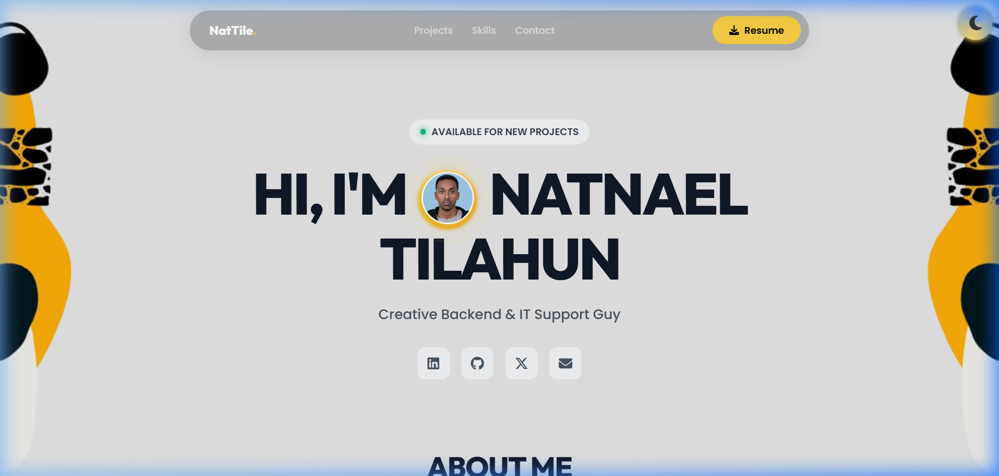
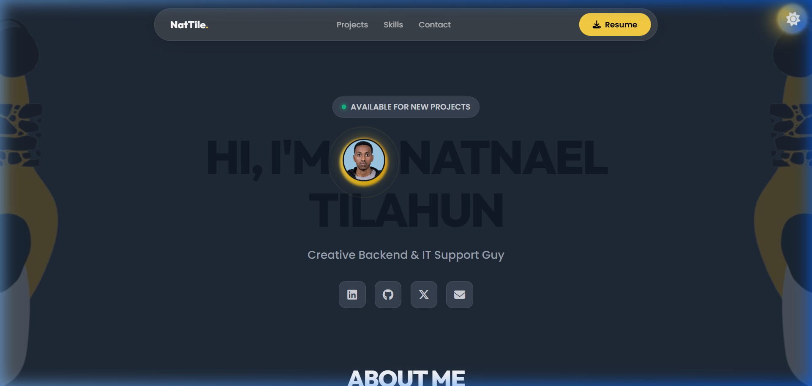
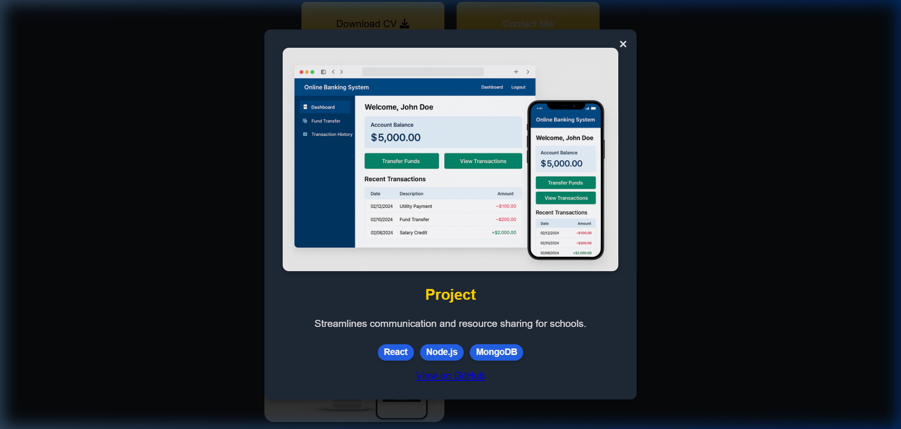
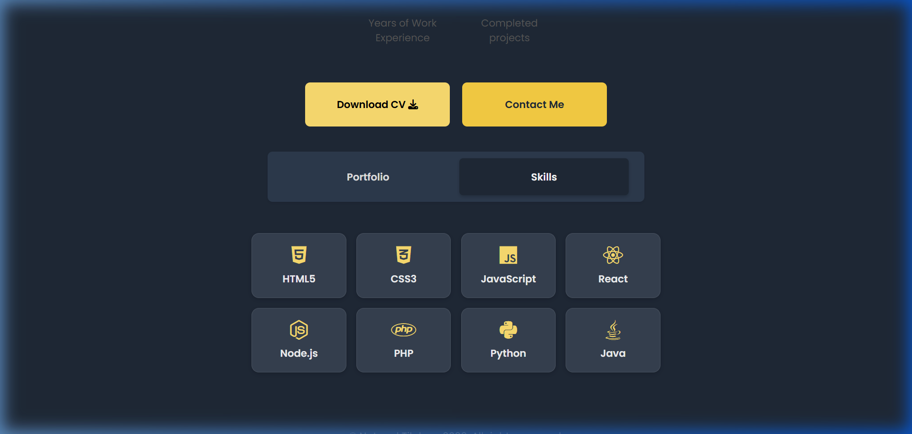
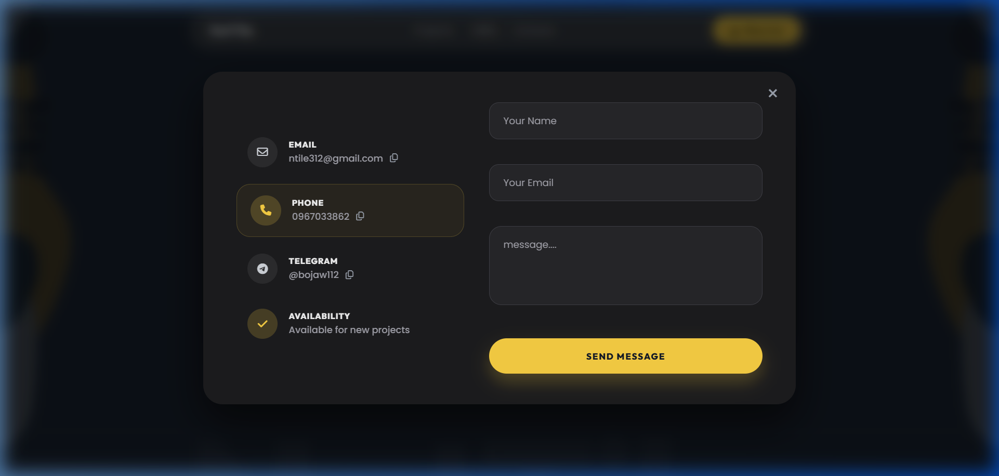

# 🚀 Personal Portfolio — Natnael Tilahun

> **A modern, responsive, and interactive developer portfolio showcasing software projects, technical skills, and experience.**

---

## ⚡ 30-Second Overview

### ❓ What is this project?
This is the personal portfolio website for **Natnael Tilahun** — a full-stack developer based in Addis Ababa. It serves as a modern digital resume and project showcase featuring custom UI themes, a Swiper-based project carousel, technical skill highlights, direct resume downloading, and a functional contact modal.

### 🏃 How do I run it?
No complex setup, build tools, or node modules required!
```bash
# 1. Clone the repository
git clone https://github.com/NatBabi/Portfolio-.git

# 2. Navigate to the project directory
cd Portfolio-

# 3. Open index.html in your browser
# Double click index.html OR run a local server:
npx serve .
```

### 🛠️ What technologies & features does it demonstrate?
* **Technologies**: HTML5 (Semantic markup), Vanilla CSS3 (Flexbox, Grid, CSS Variables, Glassmorphism), Vanilla JavaScript (DOM manipulation, Swiper carousel), Font Awesome 6, Google Fonts, Swiper.js.
* **Features**:
  * 🌓 **Dark / Light Mode Theme Switching**: Instant toggle with state persistence.
  * 🎠 **Swiper Project Carousel**: Smooth, touch-friendly sliding through project cards.
  * 🪞 **Glassmorphic UI**: Beautiful glass-effect cards and sections (like the new About section).
  * 📄 **Direct CV Download**: One-click resume download functionality.
  * 📩 **Contact Modal**: FormSubmit-integrated contact modal for instant email delivery.
  * 📱 **Fully Responsive**: Optimized for desktop, tablet, and mobile viewports.

---

## 📸 UI Screenshots

<div align="center">

### ☀️ Light Mode Homepage


### 🌙 Dark Mode Homepage


### 💻 Interactive Project Detail Modal


### 🛠️ Technical Skills Tab


### 📩 Contact Modal


</div>

---

## 🗂️ Featured Projects

| Project | Description | Tech Stack | Links |
| :--- | :--- | :--- | :--- |
| **Online Banking** | Full-stack banking app with authentication, account management, fund transfers, and transaction history. | Java, MySQL, Bootstrap, JavaScript | [GitHub](https://github.com/NatBabi/Online-Banking) |
| **Expense Tracker** | CLI tool to add, delete, and list personal expenses with monthly budgeting and data export. | Node.js, CLI | [GitHub](https://github.com/NatBabi/Expense-Tracker-CLI) |
| **Workout Tracker** | Node.js & Express web app to log and track workouts. | AWS, React, Express | [GitHub](https://github.com/NatBabi/Workout-Tracker-Web-App) |
| **CRMP (BunaCore)** | Collaborative research management platform with shared TypeScript codebase and agreed API contracts. | TypeScript, React, PostgreSQL | [Site](https://crmp-flow.vercel.app/) · [GitHub](https://github.com/BunaCore) |
| **OmniOptimize** | Live SEO optimization tool with integrated CodeRabbit code-analysis and PageSpeed SEO-analysis. | Next.js, Node.js, REST API | [Site](https://omni-optimize.vercel.app/) · [GitHub](https://github.com/andymarrow/OmniOptimize) |

---

## 📁 Repository Structure

```
Portfolio-/
├── index.html            # Main HTML document & semantic structure
├── Styles.css            # Complete styling, CSS custom variables & dark theme
├── Scripts.js            # Theme toggle, Swiper init, and modal logic
├── My-Resume.pdf         # CV downloadable file
├── .gitignore            # Git ignored files and folders
├── Icons/                # Project thumbnails & profile image assets
│   ├── ProfilePicturepng.jpg
│   ├── Online_Banking.png
│   ├── Expense-Tracker.png
│   ├── Workout-tracker.jpg
│   ├── CRMP.png
│   └── OmniOptimize.png
└── screenshots/          # Repository UI preview screenshots
    ├── light-mode.png
    ├── dark-mode.png
    ├── project-modal.png
    ├── skills-tab.png
    └── contact-modal.png
```

---

## 🛠️ Tech Stack & Badges

| Category | Technologies Used |
| :--- | :--- |
| **Frontend Core** | HTML5, Vanilla CSS3, JavaScript (ES6+) |
| **Icons & Fonts** | Font Awesome 6.5.0, Google Fonts (Outfit, Poppins) |
| **Carousel** | Swiper.js 11 |
| **Form Backend** | FormSubmit API Integration |
| **Layout Design** | CSS Flexbox, CSS Grid, Responsive Media Queries |

---

## 👨‍💻 About the Developer

**Natnael Tilahun** — Full-stack developer based in Addis Ababa, working across React, Next.js, Node.js, TypeScript, and PHP/Laravel. Experienced in building and shipping live projects end-to-end — from database design to UI — including a collaborative research platform and a banking system with real transaction logic.

* 🌐 **GitHub**: [@NatBabi](https://github.com/NatBabi)
* 💼 **LinkedIn**: [Natnael Tilahun](https://www.linkedin.com/in/Nat-tile)
* 🐦 **X (Twitter)**: [@NTilahun14](https://x.com/NTilahun14)
* 📧 **Email**: ntile312@gmail.com

---

## 📄 License

Distributed under the MIT License. Feel free to use this portfolio as inspiration for your own!
